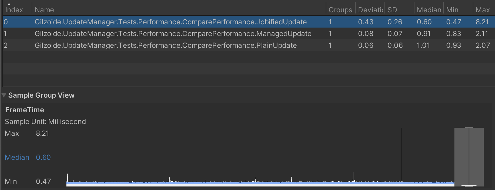

# Update Manager
[](https://openupm.com/packages/com.gilzoide.update-manager/)

Simple to use Update Manager pattern for Unity + Jobified Update for `MonoBehaviour`s and pure C# classes alike.

Using these may improve your game's CPU usage if there are thousands of objects updating every frame.

More info on Update Manager vs traditional Update: https://github.com/Menyus777/Game-engine-specific-optimization-techniques-for-Unity


## Features
- Use `UpdateManager` to call objects' `ManagedUpdate`, `ManagedLateUpdate` or `ManagedFixedUpdate` method, bypassing Unity's native <-> C# interop
- Both `MonoBehaviour` and pure C# classes are supported, just implement `IUpdatable`, `ILateUpdatable` and/or `IFixedUpdatable` interface and register the object to be updated using its `RegisterInManager` extension method.
  
  Remember to unregister the objects with `UnregisterInManager` when necessary.
- Inherit `AManagedBehaviour` to automatically register/unregister MonoBehaviours in `UpdateManager` in their `OnEnable`/`OnDisable` messages.
  The class still needs to implement the `IUpdatable`, `ILateUpdatable` and/or `IFixedUpdatable` interfaces for any managed update methods to be run.
- Profiler markers are used to show managed methods in the Unity profiler.

Job System:
- Use `UpdateJobManager<MyIUpdateJobStruct>` to run jobs every frame using Unity's Job system
- Use `UpdateTransformJobManager<MyIUpdateTransformJobStruct>` to run jobs with `TransformAccess` every frame using Unity's Job system, so you can change your objects' transforms from jobs
- Job data may be modified from within jobs and fetched anytime.
  
  This package uses double buffering to let you read values even while jobs are running and modifying data.
- Both `MonoBehaviour` and pure C# classes are supported, just implement `IJobUpdatable<MyIUpdateJobStruct>` or `ITransformJobUpdatable<MyIUpdateTransformJobStruct>` interface and register the object to be updated using `IJobUpdatable.RegisterInManager` or `ITransformJobUpdatable.RegisterInManager` extension methods.
  
  Remember to unregister the objects with `IJobUpdatable.UnregisterInManager` or `ITransformJobUpdatable.UnregisterInManager` when necessary.
- Inherit `AJobBehaviour<MyIUpdateTransformJobStruct>` to automatically register/unregister MonoBehaviours in `UpdateTransformJobManager<MyIUpdateTransformJobStruct>` in their `OnEnable`/`OnDisable` messages
- Burst compilation is supported, but you have to explicitly use the concrete types `BurstUpdateJob<MyIUpdateJobStruct>` or `BurstUpdateTransformJob<MyIUpdateTransformJobStruct>` anywhere in compiled code.

  An easy way for that is to implement `IJobUpdatable<MyIUpdateJobStruct, BurstUpdateJob<MyIUpdateJobStruct>>`/`ITransformJobUpdatable<MyIUpdateTransformJobStruct, BurstUpdateTransformJob<MyIUpdateTransformJobStruct>>` or inherit `AJobBehaviour<MyIUpdateTransformJobStruct, BurstUpdateTransformJob<MyIUpdateTransformJobStruct>>`.
- `UpdateJobTime` class with information from Unity's `Time` class that you can access from within jobs (`deltaTime`, `time`, etc...)
- Configurable job batch size using `[JobBatchSize(...)]` attribute in job structs.
  This is ignored in read-write transform jobs.
- Add dependencies between managed jobs using `[DependsOn(typeof(MyJobDependency1), ...)]`.
  
  For now, no dependency cycle detection is performed, so job runners may get deadlocked if you misuse it.


## Caveats
- `UpdateManager` doesn't have the concept of script execution order like Unity MonoBehaviours, so don't rely on execution order.
- Read-write transform jobs are only parallelized if the objects live in hierarchies with different root objects.
  This is a limitation of Unity's job system.

  Read-only transform jobs, marked by the `[ReadOnlyTransformAccess]` attribute, don't have this restriction.
- Although native container fields (`NativeArray`, `NativeList`...) are supported in managed jobs, the thread safety system provided by Unity is not applied to them.
  Use them with care!


## How to install
This package is available on the [openupm registry](https://openupm.com/) and can be installed using the [openupm-cli](https://github.com/openupm/openupm-cli):

```
openupm add com.gilzoide.update-manager
```

Otherwise, you can install directly using the [Unity Package Manager](https://docs.unity3d.com/Manual/upm-ui-giturl.html)
with the following URL:

```
https://github.com/gilzoide/unity-update-manager.git#1.4.1
```

Or you can clone this repository or download a snapshot of it directly inside your project's `Assets` or `Packages` folder.


## How to use
### `UpdateManager` + `MonoBehaviour`
```cs
using Gilzoide.UpdateManager;
using UnityEngine;

public class MyManagedUpdatableBehaviour : AManagedBehaviour, IUpdatable, ILateUpdatable, IFixedUpdatable
{
    public void ManagedUpdate()
    {
        Debug.Log("Called every frame, alongside other scripts' Update message");
    }

    public void ManagedLateUpdate()
    {
        Debug.Log("Also called every frame, alongside other scripts' LateUpdate message");
    }

    public void ManagedFixedUpdate()
    {
        Debug.Log("Also called every frame, alongside other scripts' FixedUpdate message");
    }
}
```

### `UpdateManager` with pure C# class
```cs
using Gilzoide.UpdateManager;
using UnityEngine;

public class MyUpdatable : IUpdatable, ILateUpdatable, IFixedUpdatable
{
    public void ManagedUpdate()
    {
        Debug.Log("Called every frame, alongside other scripts' Update message");
    }

    public void ManagedLateUpdate()
    {
        Debug.Log("Also called every frame, alongside other scripts' LateUpdate message");
    }

    public void ManagedFixedUpdate()
    {
        Debug.Log("Also called every frame, alongside other scripts' FixedUpdate message");
    }

    // call this when you want Updates to start running
    public void StartUpdating()
    {
        this.RegisterInManager();
        // ^ alias for `UpdateManager.Instance.Register(this)`
    }

    // call this when necessary to stop the updates
    public void StopUpdating()
    {
        this.UnregisterInManager();
        // ^ alias for `UpdateManager.Instance.Unregister(this)`
    }
}
```

### `UpdateTransformJobManager` + `MonoBehaviour`
```cs
using System.Collections;
using Gilzoide.UpdateManager.Jobs;
using UnityEngine;
using UnityEngine.Jobs;

// 1. Create the Job struct
public struct MoveJob : IUpdateTransformJob
{
    public Vector3 Direction;
    public float Speed;
    public bool SomethingHappened;

    public void Execute(TransformAccess transform)
    {
        Debug.Log("This will be called every frame using Unity's Job system");
        // This runs outside of the Main Thread, so
        // we need to use `UpdateJobTime` instead of `Time`
        float deltaTime = UpdateJobTime.deltaTime;
        // You can modify the Transform in jobs!
        transform.localPosition += Direction * Speed * deltaTime;
        // You can modify the struct's value and fetch them later!
        SomethingHappened = true;
    }
}

// 2. Create the job-updated behaviour
// Inherit `AJobBehaviour<MoveJob, BurstUpdateTransformJob<MoveJob>>`
// if you want to Burst compile the job
public class MyJobifiedBehaviour : AJobBehaviour<MoveJob>
{
    // set the parameters in Unity's Inspector
    public Vector3 Direction;
    public float Speed;

    // (optional) Set the data passed to the first job run
    public override MoveJob InitialJobData => new MoveJob
    {
        Direction = Direction,
        Speed = Speed,
    };

    IEnumerator Start()
    {
        // wait a frame to see if something happened
        yield return null;
        // use the `JobData` property to fetch the current data
        MoveJob currentData = JobData;
        // should print "Something happened: true"
        Debug.Log("Something happened: " + currentData.SomethingHappened);
    }
}
```

### `UpdateJobManager` + pure C# class
```cs
using Gilzoide.UpdateManager.Jobs;
using UnityEngine;

// 1. Create the Job struct
public struct CountJob : IUpdateJob
{
    public int Count;

    public void Execute()
    {
        Debug.Log("This will be called every frame using Unity's Job system");
        Count++;
    }
}

// 2. Create the job-updated class
// Implement `IJobUpdatable<CountJob, BurstUpdateJob<CountJob>>`
// if you want to Burst compile the job
public class MyJobifiedBehaviour : IJobUpdatable<CountJob>
{
    // Set the data passed to the first job run
    public CountJob InitialJobData => default;

    // call this when you want Updates to start running
    public void StartUpdating()
    {
        this.RegisterInManager();
        // ^ alias for `UpdateJobManager<CountJob>.Instance.Register(this)`
    }

    // call this when necessary to stop the updates
    public void StopUpdating()
    {
        this.UnregisterInManager();
        // ^ alias for `UpdateJobManager<CountJob>.Instance.Unregister(this)`
    }

    // fetch current data using `this.GetJobData`
    public int CurrentCount => this.GetJobData().Count;
}
```


## Benchmarks
1. Test with 2000 spinning cubes running at 30 FPS in a Xiaomi Redmi 4X Android device.
   - Plain Update: 12\~13ms updating, 8\~10ms spare in frame
   - Update Manager: 7\~8ms updating, 12\~15ms spare in frame
   - Fully parallelized transform job: \~2ms updating, 18\~20ms spare in frame
   
2. 1000 spinning game objects running in an automated performace testing running in a M1 Macbook Pro
   - Plain Update: \~1.01ms updating
   - Update Manager: \~0.91ms updating
   - Fully parallelized transform job: \~0.60ms updating
   